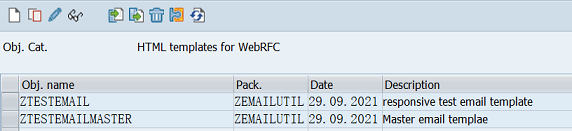
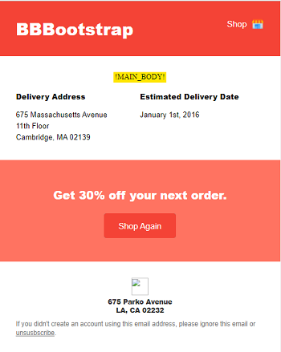
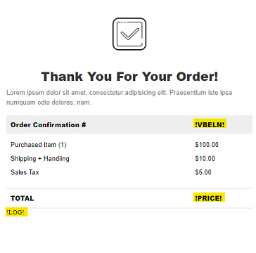
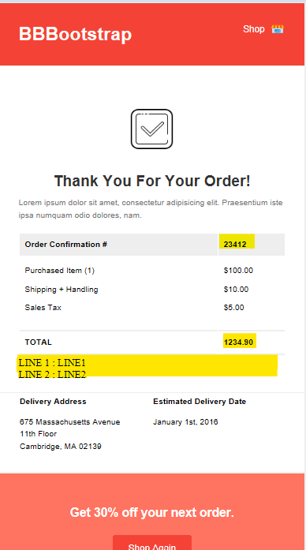

# easyHtmlEmail
### *Easy to Genrate & Maintain Email in SAP (ABAP + HTML/CSS)*
---

Generating & Maintaing E-mail through ABAP is always dirty code while buildling email body with text-elements/message class.  
Even simple plain text Email results in lots of irrelevant code in ABAP, so generating modern e-mails (HTML/CSS/images) in abap can be a nightmare for anyone.

***easyHtmlEmail*** provides a helper class `Zcl_easy_email` which helps the ABAP developer to consume HTML template to build email.  
The static part of email will no longer be handled by ABAP code, developer only need to worry about dynamic values in email.  

> Note: `Zcl_easy_email` is Built on Top of Function Module `WWW_HTML_MERGER`, so Pros & Cons are inherited. Refer [WWW_HTML_MERGER](https://help.sap.com/saphelp_autoid2007/helpdata/en/2b/d921034b8a11d1894c0000e8323c4f/content.htm?no_cache=true)

---

## Features:

- Build Modern e-mails
- Static & dynamic content segregation
- Pesentation & logic segregation
- Avoid irrelevent ABAP code resulting clean code.
- Easy maintainace & translation of emails
- Resueability
- Easy Combining of master & child email templates

---

## Steps:
1. Build email Template and upload in T-code `SMW0`.  
      
    Template must contain Placeholders for dynamic values (highlighted in yellow are placeholders).  
    
      
> Demo HTML templates is taken from [BBBootstrap public e-mail templates](https://bbbootstrap.com/snippets/order-confirmation-email-template-19073214)  

1. Maintain config in Table `ZMAIL_TEMP_CONF`.(Optional)
   
2. Create instance of `Zcl_easy_email` and set template.  
            
            DATA : go_EASY_EMAIL TYPE REF TO ZCL_EASY_EMAIL.
            CREATE OBJECT go_EASY_EMAIL .
            
            go_EASY_EMAIL->set_subject(
                title = 'mail subject '
                ).

            go_EASY_EMAIL->set_template(
                p_template       = 'ZTESTEMAIL' 
                p_mastertemplate = 'ZTESTEMAILMASTER'
                ).
            
3. Pass in Placeholder & dynamic value pairs.  

            go_EASY_EMAIL->replace_placeholder(
                EXPORTING
                placeholder_name = '!VBELN!'
                replacement_type = 'R'          "replace placeholder with single value
                single_value     = ' 23412 '
            ).

            go_EASY_EMAIL->replace_placeholder(
            EXPORTING
                placeholder_name = '!PRICE!'
                replacement_type = 'R'          "replace placeholder with single value
                single_value     = ' 1234.90
            ).

            data : multi_line TYPE soli_tab,
                   line TYPE soli.
            line = 'LINE 1 : LINE1  '.
            APPEND LINE to multi_line.
            line = 'LINE 2 : LINE2  '.
            APPEND LINE to multi_line.
            
            go_EASY_EMAIL->replace_placeholder(
            EXPORTING
                placeholder_name = '!LOG!'
                replacement_type = ' '          "replace placeholder with multiple Lines
                multi_line       =  multi_line
            ).

4. Build email , add recipients, send the mail

            go_EASY_EMAIL->add_email( email = p_email ).
            go_EASY_EMAIL->build_body( ).
            go_EASY_EMAIL->send_mail( 'X' ).

5. E-mail visible in SOST  
   

> Report `zeasy_email_demo` demonstrate the usage of class `Zcl_easy_email`.  

---

## Limitations:
- Number of Character in each line in HTML template <= 255  
- Special care of text encoding required for HTML template. For BASIS 701 templates where stored in ISO-8859-2 encoding (code page 1401), so HTML template must be developed and maintained with ISO-8859-2 encoding. Incorrect encoding may result in unexpected results.  

> SAP has introduces E-MAIL templates + CDS view in S/4 systems.

---

## License

[MIT](LICENSE)
